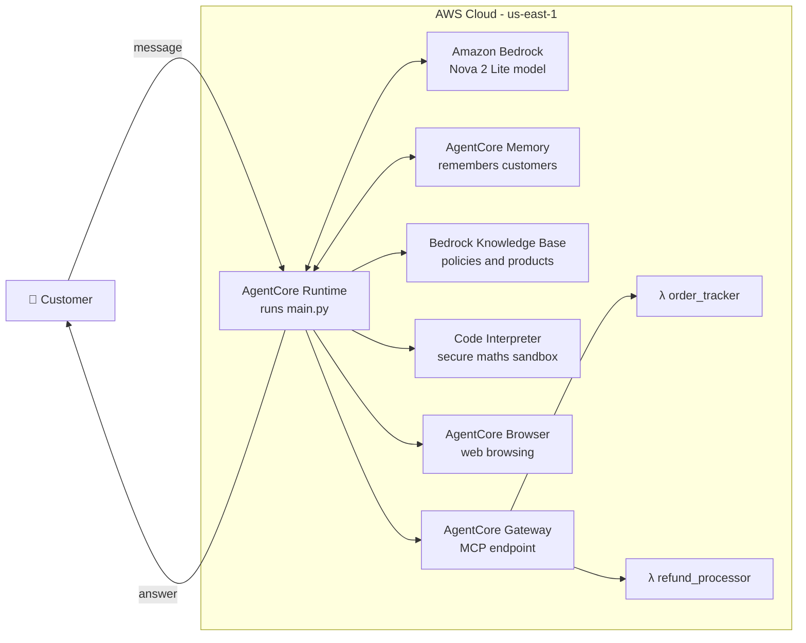
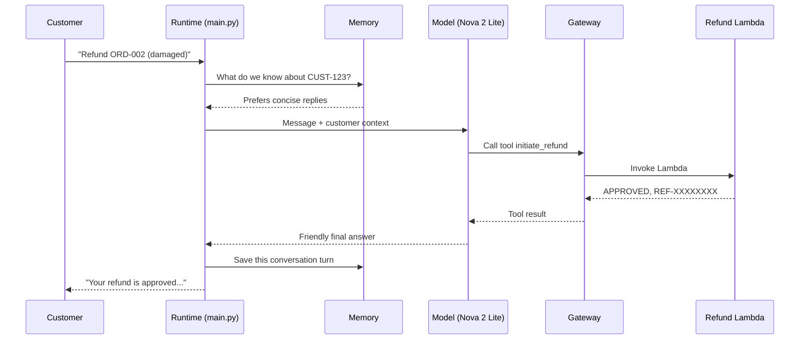

# -Customer-Support-AI-Agent-on-AWS

# 🛒 Customer Support AI Agent on AWS

> An AI-powered customer support assistant built with **Amazon Bedrock AgentCore** and the **Strands Agents SDK**. It can track orders, process refunds, answer policy questions, calculate loyalty discounts, remember returning customers, and browse the web, all from a single chat message.


---

## 📖 Table of Contents

1. [What is this project?](#-what-is-this-project)
2. [What can the agent do?](#-what-can-the-agent-do)
3. [See it in action](#-see-it-in-action)
4. [How it works](#-how-it-works)
5. [AWS services used](#-aws-services-used)
6. [Project structure](#-project-structure)
7. [Before you start (prerequisites)](#-before-you-start-prerequisites)
8. [Quick start](#-quick-start)
9. [Configuration](#-configuration)
10. [Trying it out: example requests](#-trying-it-out-example-requests)
11. [Sample data](#-sample-data)
12. [Testing results](#-testing-results)
13. [Monitoring](#-monitoring)
14. [Known limitations](#-known-limitations)
15. [Security notes](#-security-notes)
16. [Full documentation](#-full-documentation)
17. [Glossary](#-glossary)

---

## 🤔 What is this project?

Imagine a shop's support desk. A customer writes:

> *"Where is my order ORD-001?"* or *"I'd like a refund, my Kindle arrived damaged."*

Normally a human looks up the order, checks the policy, and clicks a few buttons. This project is an **AI agent** that does that work itself.

An **agent** is different from a plain chatbot. A chatbot only *talks*. An agent can also **take actions** by calling **tools** (small pieces of code or services). In this project, the agent decides on its own which tool to use, uses it, and then writes a friendly answer based on the real result.

**Key idea:** the agent is told to *never guess*. If someone asks about a return window, it looks it up in a knowledge base. If someone asks for a discount amount, it runs real code to do the maths. This is what keeps the answers trustworthy.

---

## ✨ What can the agent do?

| # | Capability | Example question | How it does it |
|---|-----------|------------------|----------------|
| 1 | 📦 **Track orders** | "Where is order ORD-001?" | Calls an **order-tracking Lambda** through the Gateway |
| 2 | 💸 **Process refunds** | "Refund my damaged Kindle (ORD-002)" | Calls a **refund Lambda** through the Gateway |
| 3 | 📚 **Answer policy & product questions** | "What are the Platinum tier benefits?" | Searches a **Knowledge Base** (RAG) |
| 4 | 🧠 **Remember customers** | "Do you remember my preferences?" | Uses **AgentCore Memory** across separate chat sessions |
| 5 | 🧮 **Calculate loyalty discounts** | "I'm Gold with 4250 points, discount on a $150 order?" | Runs Python in the **Code Interpreter** sandbox |
| 6 | 🌐 **Browse the web** | "Go to udacity.com and tell me the page title" | Uses the **AgentCore Browser** tool |

---

## 📸 See it in action

Real screenshots from testing the deployed agent (more in [docs/04-testing.md](docs/04-testing.md)):

| Order tracking | Refund processing |
|---|---|
|  |  |

| Knowledge base (RAG) | Loyalty discount |
|---|---|
|  |  |

---

## 🧩 How it works

### The big picture



### The life of one message (step by step)

1. **The customer sends a message** such as *"Refund order ORD-002, it arrived damaged."* The request is a small JSON object: `{"prompt": "...", "customer_id": "CUST-123", "session_id": "..."}`.
2. **AgentCore Runtime** starts `main.py` and calls the `invoke()` function.
3. **Memory lookup:** before the model sees the message, a *hook* searches long-term memory for things we already know about this customer (for example "prefers concise answers") and adds them to the message.
4. **The model thinks.** The Nova 2 Lite model reads the message and decides which tool(s) to call.
5. **A tool runs.** For a refund, the agent calls a tool exposed by the **Gateway**, which triggers the **refund Lambda function**.
6. **The model writes the final answer** using the real tool result.
7. **Memory save:** after replying, a second hook saves the question and answer, so the agent remembers them next time, even in a brand-new session.

### The same flow as a sequence diagram



---

## ☁️ AWS services used

| Service | What it does here | Simple analogy |
|---|---|---|
| **Amazon Bedrock** (Nova 2 Lite) | The "brain" that understands requests and writes replies | A smart employee |
| **Bedrock AgentCore Runtime** | Hosts and runs the agent code in the cloud | The office building |
| **AgentCore Gateway** | One front door that exposes Lambda functions as tools over MCP | A reception desk that routes requests |
| **AWS Lambda** | Runs the order and refund logic | Back-office specialists |
| **Bedrock Knowledge Base** | Stores product and policy documents for search (RAG) | The company handbook |
| **AgentCore Memory** | Remembers customers across sessions | A notebook with each customer's details |
| **AgentCore Code Interpreter** | Runs Python safely for exact calculations | A calculator in a locked room |
| **AgentCore Browser** | Lets the agent visit web pages | A web browser the agent can drive |
| **Amazon CloudWatch** | Logs, metrics and alarms | The security camera and alarm system |
| **IAM** | Controls who and what may access what | Staff ID badges |

---

## 📁 Project structure

```text
customer-support-agent/
├── main.py                     # 🧠 The agent: tools, memory hook, entrypoint
├── product_catalog.txt         # 📚 Source document for the Knowledge Base
├── pyproject.toml              # 📦 Python project + dependency list
├── lambda/
│   ├── order_tracker.py        # 📦 Order & customer lookups (API Gateway proxy style)
│   ├── refund_processor.py     # 💸 Refund tools (invoked directly by AgentCore Gateway)
│   └── lambda_schema           # 📝 JSON describing the refund tools for the Gateway
├── src/customer_support_agent/
│   └── __init__.py             # Package placeholder
├── docs/                       # 📖 Detailed documentation (start with docs/README.md)
│   ├── README.md
│   ├── 01-architecture.md
│   ├── 02-setup-and-deployment.md
│   ├── 03-tools-reference.md
│   ├── 04-testing.md
│   ├── 05-troubleshooting.md
│   ├── 06-security-and-production-readiness.md
│   ├── 07-lessons-learned.md
│   ├── reflection-original.txt
│   └── images/                 # Test screenshots
└── README.md                   # 👈 You are here
```

**Where should a beginner start reading?** Open `main.py` from top to bottom. It is organised in labelled sections: configuration → memory hook → tools → entrypoint.

---

## ✅ Before you start (prerequisites)

| You need | Why | Notes |
|---|---|---|
| An **AWS account** | Everything runs on AWS | Costs may apply, see the note below |
| **AWS CLI**, configured | To authenticate and deploy | Run `aws configure` or use SSO |
| **Python 3.13+** | Required by `pyproject.toml` | Check with `python --version` |
| **[uv](https://docs.astral.sh/uv/)** | Fast Python package manager (a `uv.lock` was used) | `pip install uv` |
| **Bedrock model access** | So the agent may call Nova 2 Lite | Enable in the Bedrock console |
| Permissions for AgentCore, Lambda, Bedrock, CloudWatch | To create the resources | See [security notes](docs/06-security-and-production-readiness.md) |

> 💰 **Cost note:** Bedrock model calls, AgentCore Runtime, Knowledge Base storage and Lambda are billed by usage. Delete resources you no longer need when you finish experimenting.

---

## 🚀 Quick start

This is the short version. The full walkthrough is in [docs/02-setup-and-deployment.md](docs/02-setup-and-deployment.md).

### 1. Get the code and install dependencies

```bash
git clone <your-repo-url>
cd customer-support-agent
uv sync
```

### 2. Create the supporting AWS resources

You must create these once (in **us-east-1**):

1. **Knowledge Base:** upload `product_catalog.txt` as its data source and sync it.
2. **Two Lambda functions:** deploy `lambda/order_tracker.py` and `lambda/refund_processor.py`.
3. **AgentCore Gateway:** add both Lambdas as targets. Use `lambda/lambda_schema` for the refund tools.
4. **AgentCore Memory:** create a memory resource with long-term strategies.

### 3. Put your resource IDs into `main.py`

See [Configuration](#-configuration) below.

### 4. Make sure the deploy entrypoint is active

At the very bottom of `main.py`:

```python
if __name__ == "__main__":
    app.run()          # ✅ use this when DEPLOYED
    # main()           # ❌ only use this for local command-line testing
```

> ⚠️ **This one trips people up.** If `main()` is active in a deployed agent, it prints a usage error and exits, so your agent times out on startup. See [Troubleshooting](docs/05-troubleshooting.md).

### 5. Deploy and test

With the AgentCore starter toolkit CLI (installed by `uv sync`):

```bash
agentcore configure --entrypoint main.py
agentcore launch
agentcore invoke '{"prompt": "Where is order ORD-001?", "customer_id": "CUST-123"}'
```

> Command names can change between toolkit versions. If one fails, run `agentcore --help` or check the official AgentCore docs.

---

## ⚙️ Configuration

All configuration lives near the top of `main.py`:

```python
GATEWAY_URL = "https://<your-gateway-id>.gateway.bedrock-agentcore.us-east-1.amazonaws.com/mcp"
KB_ID       = "<your-knowledge-base-id>"
REGION      = "us-east-1"
MEMORY_ID   = "<your-memory-id>"
model_id    = "global.amazon.nova-2-lite-v1:0"
```

| Setting | What it is | Where to find it |
|---|---|---|
| `GATEWAY_URL` | Address of your AgentCore Gateway (MCP endpoint) | Bedrock AgentCore → Gateways |
| `KB_ID` | ID of your Knowledge Base | Bedrock → Knowledge Bases |
| `REGION` | AWS region for everything | Keep it consistent across services |
| `MEMORY_ID` | ID of your AgentCore Memory resource | Bedrock AgentCore → Memory |
| `model_id` | Which foundation model to use | Bedrock → Model catalog |

> 🔐 **Tip:** before publishing to GitHub, move these values into environment variables (`os.environ["KB_ID"]`, etc.) so no account-specific IDs are committed. See [security notes](docs/06-security-and-production-readiness.md).

---

## 💬 Trying it out: example requests

The agent expects a JSON payload:

| Key | Required | Meaning |
|---|---|---|
| `prompt` | ✅ | The customer's message |
| `customer_id` | ❌ | Who is asking (defaults to `"anonymous"`). Memory is stored **per customer**. |
| `session_id` | ❌ | Conversation ID (a random one is generated if missing) |

Try these:

```json
{"prompt": "Where is my order ORD-001?", "customer_id": "CUST-123"}
{"prompt": "I want to return my Kindle Paperwhite (ORD-002), it arrived damaged. Please refund the full amount.", "customer_id": "CUST-123"}
{"prompt": "What are the benefits of the Platinum loyalty tier?", "customer_id": "CUST-123"}
{"prompt": "I am a Gold member with 4250 points. Calculate my discount on a $150 standard order.", "customer_id": "CUST-123"}
{"prompt": "Hi, I am Jane. I prefer concise responses.", "customer_id": "CUST-123", "session_id": "s-A"}
{"prompt": "Do you remember my name and communication preference?", "customer_id": "CUST-123", "session_id": "s-B"}
{"prompt": "Go to https://www.udacity.com and tell me the page title.", "customer_id": "CUST-123"}
```

---

## 🗃️ Sample data

The Lambdas use **hard-coded demo data** (no database), so you can test without setting anything up.

**Customers**

| ID | Name | Tier | Points |
|---|---|---|---|
| `CUST-123` | Jane Smith | Gold | 4250 |
| `CUST-456` | Bob Johnson | Silver | 890 |

**Orders**

| ID | Customer | Status | Items | Total |
|---|---|---|---|---|
| `ORD-001` | CUST-123 | SHIPPED | Wireless Headphones Pro | $89.99 |
| `ORD-002` | CUST-123 | DELIVERED | Kindle Paperwhite | $139.99 |
| `ORD-003` | CUST-456 | PROCESSING | Echo Dot ×2, Smart Plug | $124.97 |

---

## 🧪 Testing results

Six functional tests were run against the deployed agent. Full details and screenshots are in [docs/04-testing.md](docs/04-testing.md).

| # | Test | Result |
|---|---|---|
| 1 | Order tracking | ✅ Returned status, carrier, tracking number and ETA |
| 2 | Refund processing | ✅ Refund approved with ID `REF-…` and 3–5 day timeline |
| 3 | Knowledge base (RAG) | ✅ Correct Platinum tier benefits from the catalog |
| 4 | Cross-session memory | ✅ New session recalled "prefers concise responses" |
| 5 | Loyalty discount (Code Interpreter) | ⚠️ Tool ran; the agent's written summary had arithmetic errors, see [known limitations](#-known-limitations) |
| 6 | Browser tool | ✅ Fetched the correct page title |

---

## 📊 Monitoring

A **CloudWatch alarm** named `customer-support-agent-error-alarm` watches for errors. It triggers when `ErrorCount > 5` within 5 minutes. It currently has **no notification action** attached, and shows "Insufficient data" until traffic flows.

To read live logs (replace the runtime name with yours):

```bash
aws logs tail /aws/bedrock-agentcore/runtimes/<your-runtime-name>-DEFAULT --follow
```

---

## ⚠️ Known limitations

This is a **learning prototype**, not production software. Honest list:

1. **Loyalty summary can disagree with the tool.** In test 5 the tool's logic yields a $11 tier discount and $99 final total for a $150 order, but the agent's message said $15 and $95. The language model re-stated the numbers incorrectly. Fix: return only the tool's JSON fields verbatim, and add an automated test.
2. **Tier-discount ordering.** The Code Interpreter path applies the tier discount *after* points are subtracted; the fallback path applies it to the *full* order total. The two paths give different answers.
3. **Refunds have no safety checks.** No ownership check (does this order belong to this customer?), no eligibility check (return window), and no human approval.
4. **Mock data only.** Orders, customers and refund statuses are hard-coded.
5. **Open Gateway.** The Gateway has no authorization, so anyone with the URL could call it.
6. **Broad IAM permissions** were used while debugging.
7. **Consent bypass:** `BYPASS_TOOL_CONSENT=true` lets tools (including the browser) run without confirmation.
8. **Hard-coded resource IDs** in `main.py`.

Details and recommended fixes: [docs/06-security-and-production-readiness.md](docs/06-security-and-production-readiness.md).

---

## 🔐 Security notes

Please read this before pushing to a public repository:

- **Do not commit credentials.** Never commit files like `newcreds.txt`, `.env`, or AWS keys.
- **Review screenshots.** The images in `docs/images/` may show your AWS account ID and session details. Crop or blur them.
- **Replace real IDs** (Gateway URL, Knowledge Base ID, Memory ID) with placeholders or environment variables.
- **Apply least privilege** to the agent's IAM role before any real use.

---

## 📚 Full documentation

| Document | What you'll learn |
|---|---|
| [docs/README.md](docs/README.md) | Documentation index and reading order |
| [01-architecture.md](docs/01-architecture.md) | Components, data flow, design decisions |
| [02-setup-and-deployment.md](docs/02-setup-and-deployment.md) | Step-by-step build and deploy guide |
| [03-tools-reference.md](docs/03-tools-reference.md) | Every tool, input, output and the loyalty maths |
| [04-testing.md](docs/04-testing.md) | Test cases, evidence and findings |
| [05-troubleshooting.md](docs/05-troubleshooting.md) | Common problems and fixes |
| [06-security-and-production-readiness.md](docs/06-security-and-production-readiness.md) | Risks and a hardening checklist |
| [07-lessons-learned.md](docs/07-lessons-learned.md) | What worked, what didn't, what's next |

---

## 📘 Glossary

Plain-English explanations of the core terms used in this project.

**Agent (AI agent)**
An AI program that can *decide* what to do and *take actions* using tools, not just chat. Think of a helpful assistant with a toolbox.

**Amazon Bedrock**
An AWS service that lets you use powerful AI models (like Amazon Nova) through an API, without running the models yourself.

**Amazon Nova 2 Lite**
The AI model used here as the agent's brain. "Lite" means it is designed to be fast and low-cost.

**AgentCore (Amazon Bedrock AgentCore)**
A set of AWS services for building and running agents safely at scale: Runtime, Gateway, Memory, Code Interpreter, and Browser.

**AgentCore Runtime**
The cloud "home" where your agent code runs. You give it `main.py` and it hosts it as a service.

**AgentCore Gateway**
A single front door that turns your existing APIs and Lambda functions into tools the agent can call.

**AgentCore Memory**
A storage service so the agent can remember things about a customer between conversations.

**AgentCore Code Interpreter**
A secure, isolated environment where the agent can run code (here: Python for exact maths).

**AgentCore Browser**
A managed web browser the agent can control to open pages and read content.

**API**
A way for programs to talk to each other by sending requests and getting responses.

**ARN (Amazon Resource Name)**
A unique "address" for any AWS resource, for example a Lambda function or an agent runtime.

**AWS Lambda**
A service that runs a small piece of code only when it is needed, with no servers to manage. You pay only for the time it runs.

**CloudWatch**
AWS's monitoring service. It stores **logs** (what happened), **metrics** (numbers over time) and **alarms** (alerts when something looks wrong).

**Cold start**
The extra delay when a cloud service starts up for the first time or after being idle.

**Entrypoint**
The function where a program begins. Here it is `invoke()` in `main.py`, marked with `@app.entrypoint`.

**Foundation model (LLM)**
A large AI model trained on lots of text that can understand and produce language. LLM stands for *Large Language Model*.

**Hallucination**
When an AI states something confidently that is wrong or made up. Tools, retrieval and code execution reduce it.

**Hook**
A piece of code that runs automatically at a specific moment. This project has hooks that run *before* the model reads a message (load memory) and *after* it replies (save memory).

**IAM (Identity and Access Management)**
AWS's permission system. It decides who or what may do which actions.

**JSON**
A simple text format for structured data, like `{"prompt": "hello"}`.

**Knowledge Base**
A searchable library of your documents (here `product_catalog.txt`) that the agent can look things up in.

**Least privilege**
A security principle: give a system only the permissions it truly needs, nothing more.

**MCP (Model Context Protocol)**
A standard way for AI agents to discover and call tools. The Gateway speaks MCP.

**Mock data**
Fake sample data used for demos and testing, instead of a real database.

**Payload**
The data sent in a request. Here: the JSON containing `prompt`, `customer_id` and `session_id`.

**RAG (Retrieval-Augmented Generation)**
A technique where the agent first *retrieves* relevant text from a knowledge base, then *generates* an answer based on it. This keeps answers grounded in real documents.

**Region**
A physical AWS location. This project uses `us-east-1` (N. Virginia). Resources must be in the same region to work together easily.

**Sandbox**
A locked-down environment where code can run without harming anything else.

**Session**
A single conversation, identified by a `session_id`. **Long-term memory** lets the agent remember a customer *across* sessions.

**Strands Agents**
An open-source Python SDK that makes it easy to build agents: you give it a model, tools and a prompt.

**System prompt**
Hidden instructions that tell the agent who it is and how to behave (for example, "always use the tool rather than guessing").

**Tool**
A function the agent can call to do something real, like search a knowledge base, look up an order, or run code. In Strands, tools are Python functions marked with `@tool`.

**uv**
A fast Python tool for installing packages and managing project environments.

---

<p align="center">Built as a hands-on project to learn agentic AI engineering on AWS. 🚀</p>
